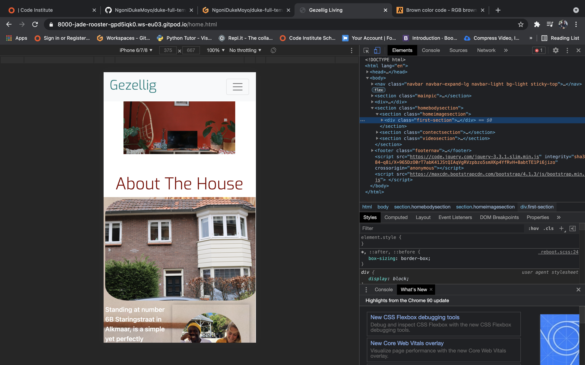
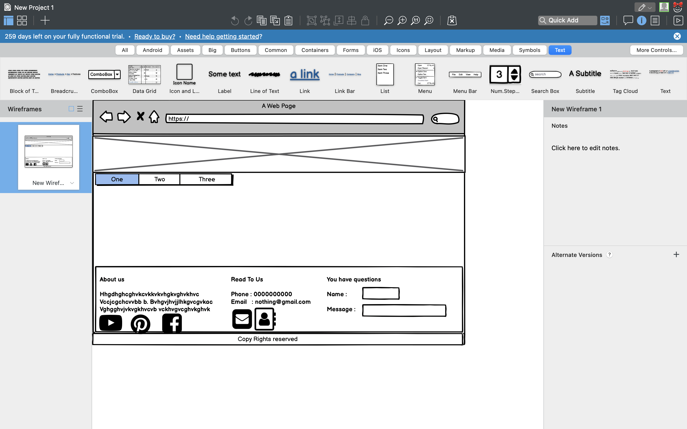
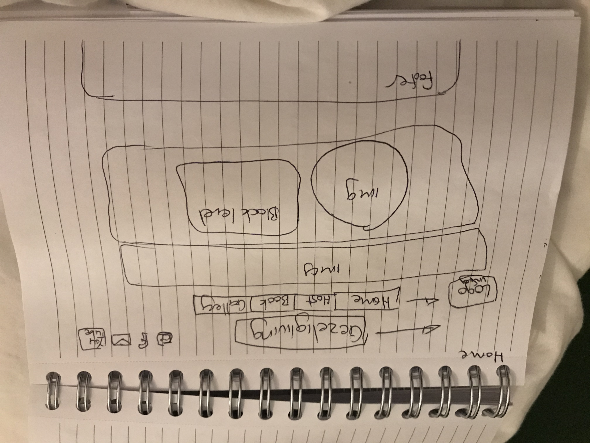
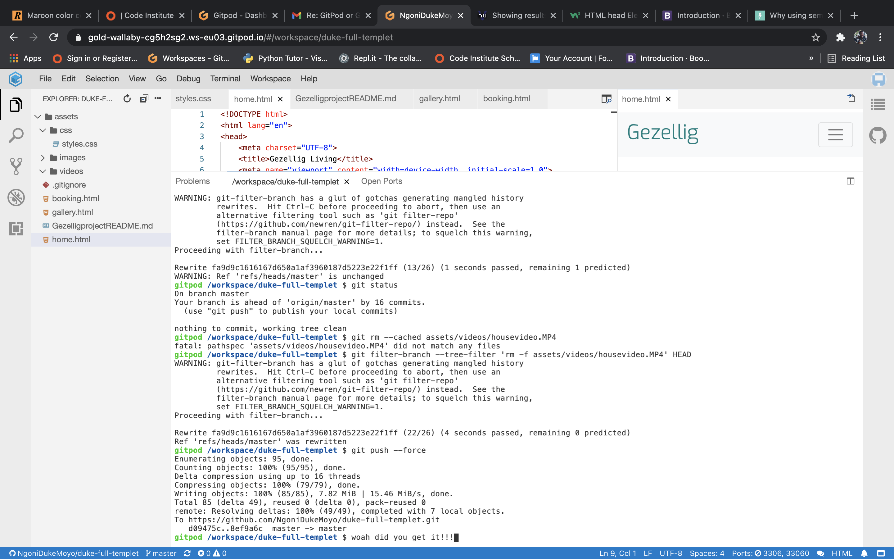
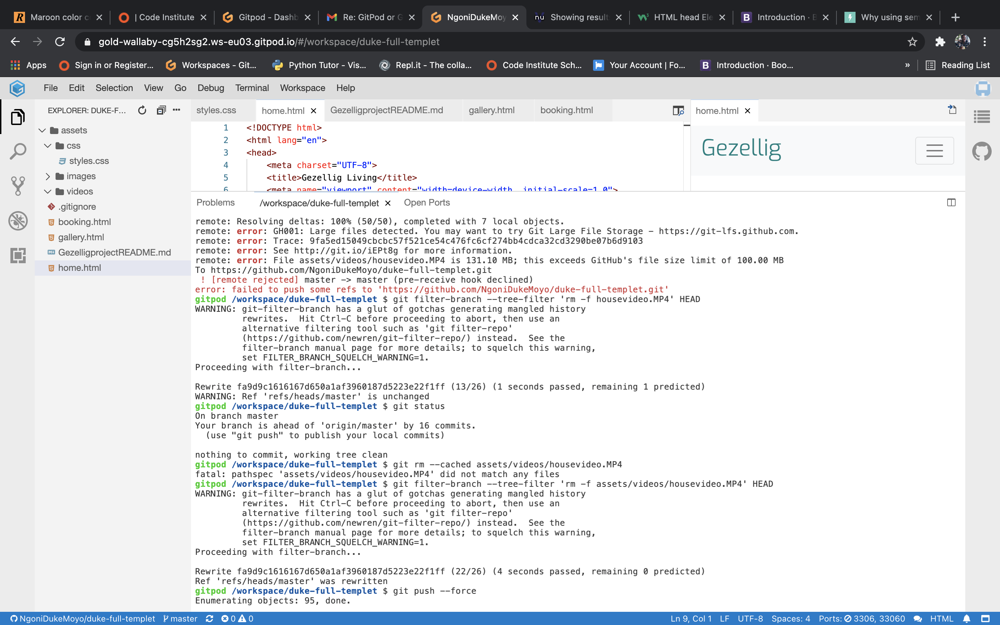
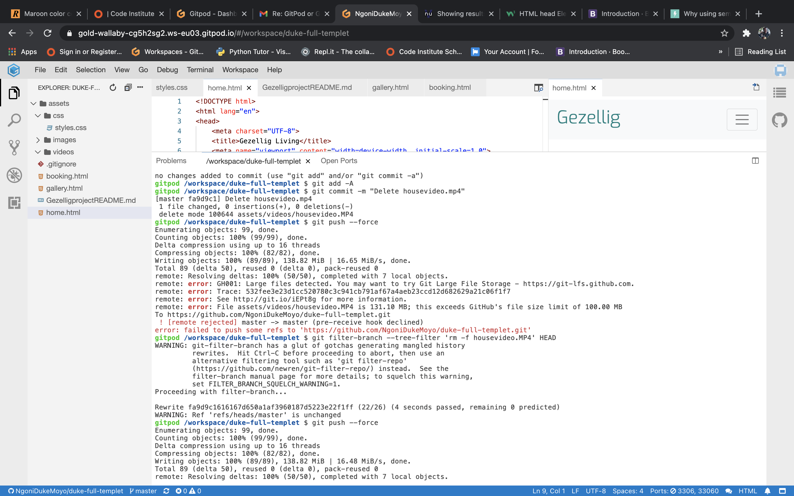
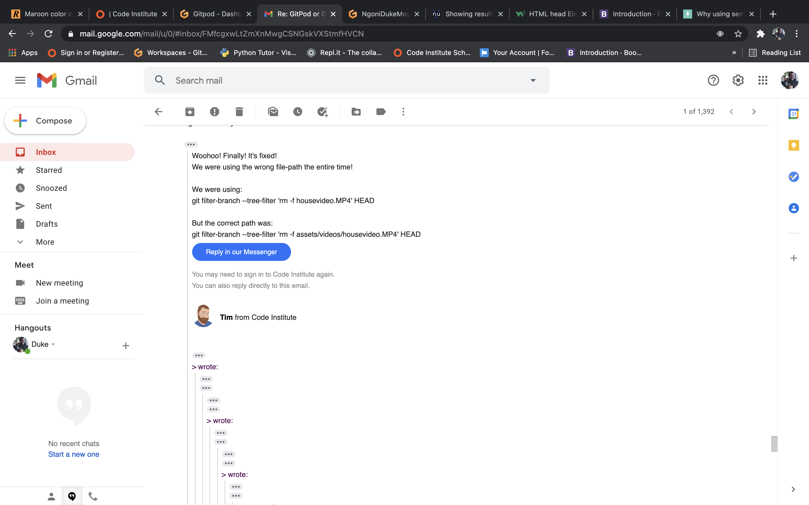

<!--Heading-->
# Gezelling Living Website(Cosy living)

This is the main look for the website. It is designed to be responsive and accessible on mobile and large screen devices. Making it a simple easy
navigation for all interested visitors.

The aim is to create a platform shwoing creativity that the target audience will take time to appriciate
as a rented living space. This focuses on beauty with an eye for design and colors more than quantity and the product itself.

<!--UX & User stories-->

# User Experience

## User Stories
### First time visitors Goals
As a first time visitor, i want to easily understand the main purpose of the website and understand the purspective of the creator's intention of the site.
As a first time visitor, i want to be able to easily navigate throughout the site to find what is the offer, how much will it cost and where to book.
As a first time visitor i want see guest reviews located either on their website or through socials of the website.
As a first time visitir i want to know what makes the business stand-out better than the rest.

### Second Visitors Goals
As a second visitor i want to find out about any additional updates to the stay or discounts relevant to the stay.
As a returning visitor i want to find the best way to get in contact with the organisation with any questions i may have.

### Frequent User Goals
As a Frequent User i want to sign up to the newsletter so that i am emailed any major updates or changes to the website or the accomodation.

<!--Design-->
## Color Scheme
The main colors used are Maroon, teal and dar yellow.
I want to go on the wensite and be immidiately capitivated with the colors and the furniture with the way it is displayed, then simply press book.

## Typography
The Exo font family is the main font used throughout the whole website with San Serif as the fallback font incase the font isnt being imported into the site correctly.
I chose the font "Exo" because of its simplicity but neat impression which compliments the aim of the website itself.

## Imagery

The large heading image is designed to automatically prompt the viewer about the design, colors and idea of the space. This project is targeted at a specific audience that feels the need to stay in a space of authenticity, 
a space that represent something of value to them •creativity, design and color•. Normally this particular audience 
can read/sense that feeling as soon as soon as they lay their eyes on the front door of the living space in its failure or success to stand out. 
If that front door does not represent that symbol then they quickly move on. This website aims to be that front door.

This audience wants to feel understood and appriciated by being complimented with an authentic living space to make them feel
welcome. This website is aimed to grab their attention straight off the bat as they look at the home page filled with the right criteria.

The audiencealso appriciate simplicity therefore as much as design and creativity is a big factor to create the website, 
simplicity in navigation and action is crucial therefore the website has no clatter and is easy to navigate. 

The header, navbar and footer in the home page, provide clear and simple info to make it as quick and easy interaction.
The body provides a small quick read history into the space for a background info to provide symbolism which will be appriciated (aunthenticity).

## wireframes

## wireframes

After a meeting with my mentor, this will be the new nav and footer approach.

<!--features-->

## features
-Responsive on mobile and large screen sizes
-video imagery

# Technologies used
## Languages used
-HTML5 
-CSS3

## Frameworks, Libraries & Programs used
-Bootstrap 4.4.3 : Bootstrap was used to assist with responsiveness and styling of the website. Bootstrap also was used to create the Gallery's rows and columns for design. 
-Hover.CSS : Hover was used on social Media icons in the footer to add color change indicating option while being hovered over. 
-Google Fonts : Google fonts were used to import the Exo font family into the style.css file which is used on all pages throughout the project. 
-Font Awesome 5.15.2 : Font Awesome was used on all pages throughout the website to add icons for UX purposes. 
-JQuery 3.3.1 : JQuery came with Bootstrap to make the navbar responsive. 
-Git : Git was used for version control by utilizing the Gitpod terminal to commit to Git and Push to GitHub.  
-GitHub : GitHub was used to store the projects code after being pushed from Git. 
-Balsamiq :
Balsamiq was used to create some starting wireframes during the design process 

# Testing 
The W3C Markup Validator and W3C CSS Validator Services were used to validate every page of the project to ensure there were no syntax errors in the project.
-W3C Markup Validator : [Results](https://validator.w3.org/nu/?doc=https%3A%2F%2Fgold-wallaby-cg5h2sg2.ws-eu03.gitpod.io%2F) 
-W3C CSS Validator : [Results](https://jigsaw.w3.org/css-validator/validator?uri=https%3A%2F%2Fgold-wallaby-cg5h2sg2.ws-eu03.gitpod.io%2F%23%2Fworkspace%2Fduke-full-templet&profile=css3svg&usermedium=all&warning=1&vextwarning=&lang=en) 

# Testing User Stories from User Experience
## First time visitor Goals
-As a first time visitor i want to easily understand the purpose of the site and get a clear and easy access and view of the offer. 
.When i enter the site users are exposed to a clean and readable navigation bar to got to the page of choice. 
.Users have the option of navigating with the navbar or scroll to the bottom to access footer with socials and contact. 
-As a First time Visitor, i want to be able to easily be able to navigate through the site to find content about the product. 
.The site is designed in the way that the user is not entrapped. At the top of each page has a navigation bar with each link describing the location it will lead. 
.At the bottom of all pages in footer for contact and social media also used as platform for reviews, to ensure the visitor always has somewhere to go. 
-As a First time Visitor, i want to look for testimonials to understand what the users think of the accomodation and if it is trusted. 
.The user can use the socials section to visitor those platforms to see what users think of the accomodation. 

## Returning Visitor Goals
-As a Returning Visitor, i want to find the new updates or discounts on the accomodation. 
.The users will access these updates through the social media platforms which will be regulary updated with offers and updates of the accomodation. 
-As a Returning Visitor, i want to find the best way to get in conact with the host for questions. 
.The navbar contains the booking session then when user scrolls to the footer they can clearly see the our contact details taking 90% of the footer. 
They will either use the contact details provided or they can fill out the message form. 

## Frequent User Goals
-As a frequent user, i want to check to if there any new added offers and discounts. 
.Socials to access the everyday updates. 

# Further Testing
-The site was tested on google chrome and safari. 
-The site was views on mobile and large screen devices 
-Alot of test done to ensure that all pages were linking correctly 
-Girlfriend aked to review to point out bugs 
-Mentor support as testing to point out bugs and user experience issues 

# Bugs
-The video here goes off to the right when viewing in mobile screens. 
-The mainbody image is not centered in mobile view. 

# Deployment

## GitHub Deployment
-The project was deployed to GitHub Pages using the following steps :
.Log into the GitHub and locate the GitHub Repository 
.Go to settings button on the menu 
.Scroll down to pages section 
.under source click the dropdown named "none" and select "Master Branch" 
.Scroll down through the page to find the now published link in GitHub pages section. 

# Credits
## code
-Bootstrap Library used through out the project, mainly ( Grid systems, Navbar and navbar toogle, gallery)

## content
-All content was written by the developer.

## Media 
-All images were created by the developer.

## Acknowledgements
-My mentor for helping through this process  
-Tutor support with alot of bugs 
-Colors (https://www.rapidtables.com/web/color/brown-color.html) 
-Video Compress (https://www.youcompress.com/) 
-Google Fonts 
-CodingNepal (responsive footer) 
-Traversy Media(tutorials) 
-Clever Techie(tutorials) 
-Code Institute (Readme file) 

 

<!--Challenges faced in Project-->
  # challenges
  Currently struggling with the css for my footer. I am trouble shooting the media queries, footer container, the footer positioning, which i think are the problem but
  its possible to be a big issue to overcome as i am unable to pin-point the issue. I contacted student support and we were not very successful. (20/3)
  - (fix) Mentor helped realise i was using wrong positioning elements and wrong footer targets for the footer in MediaQueries.
  Issues with the Navbar Bootstrap toogle not dropping down the toogle nav menu
  -(fix) order of script for JQuery and Bootstrap cdn
  Issues with the project not staging all the commits and pushing them to Github.
  - This was caused because of a large video file (150MB) and was stopping all the commits to push.
  
  
  
  

